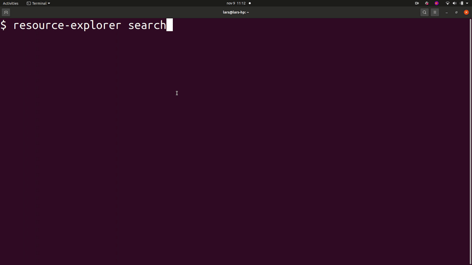

# aws-resource-explorer-cli 
Searches AWS resources and launches them in the AWS console in your browser.

This is using the [Resource Explorer feature](https://aws.amazon.com/blogs/aws/introducing-aws-resource-explorer-quickly-find-resources-in-your-aws-account/) and works similarly to typing `/Resource <your query>` in the AWS console search bar, but lets you do it in your terminal instead for increased productivity.

Note that this only works with supported resources. Find out which are indexed in the [Resource Explorer](https://docs.aws.amazon.com/resource-explorer/latest/userguide/supported-resource-types.html) documentation.

## Installation
```
npm i -g aws-resource-explorer-cli
```

## Query syntax
Please study the [AWS Resource Explorer](https://docs.aws.amazon.com/resource-explorer/latest/userguide/using-search-query-syntax.html) documentation to get the most out of your searches.

## Demo


## Commands

* `resource-explorer search <query>` - Free text search of all your supported resources
* `resource-explorer stack-resources <query>` - Browse the resources in a CloudFormation stack and navigate to their console page

Note that you can also access the command via its alias `resexp` where `resource-explorer stack-resources --stack-name my-stack` can be abbreviated as `resexp sr -s my-stack`
